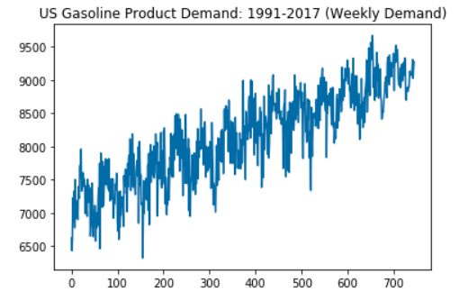
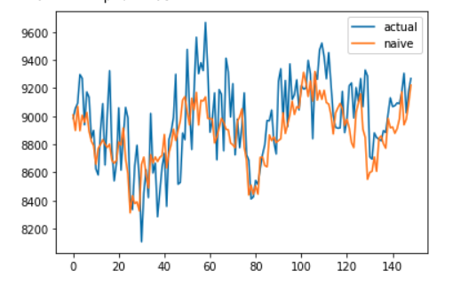

# SageMaker로 싱글 타임시리즈 시계열 예측 워크샵

## 목적
이 워크샵은 SageMaker에서 시계열 예측(예: Demand Forecasting)에 관한 문제를 여러가지 방식으로 모델을 생성하고 추론하는 방법을 알기 위함입니다. **이 워크샵은 싱글 타임 시리즈를 다루는데 적합하고, 복수개의 타임 시리즈는 DeepAR 및 Gluon TS 등이 적당합니다.**

**아래와 같은 부분을 배우게 됩니다.**
- SageMaker Linear Learner 내장 알고리즘을 통한 훈련, 배포 및 추론
- SageMaker 노트북 에서 오픈 소스 (SK Learn)를 사용하여 모델 생성 및 추론
- SageMaker의 사용자 정의 스크립트 (Bring Your Own Scipt)을 사용하여 "사용자 정의 모델 정의" 생성 및 훈련 하는 방법. 이를 위해서 로컬 모드와 클라우드 모드 두가지 방식을 배웁니다.
- SageMaker에서 "사용자 정의 모델"을 로컬 및 클라우드에서 배포. 또한 사용자 정의의 추론 코드를 사용하는 방법을 배웁니다.

## 데이터
- 미국 가솔린 프더덕트의 주간 사용량을 사용합니다.
- US Gasoline Product Demand: 1991-2017 (Weekly Demand) 를 사용합니다. 데이터의 설명은 여기를 참조하세요. [Here](https://rdrr.io/github/robjhyndman/fpp/man/gasoline.html)

#### 모델 생성 후 추론 예시 (Ridge Regression 사용)

## 노트북 설명
- 1.1.Linear_Learner_Forecast.ipynb
    - SageMaker의 내장 알고리즘인 Linear_Learner를 사용하여 훈련 및 추론
- 2.1.SKLearn_Forecast.ipynb
    - SKLearn의 Ridge, Lasso Regresson 및 XGBoost 모델을 사용하여 훈련 및 추론 합니다.
- 2.2.Train_BYOS_Forecast.ipynb    
    - 사용자 정의의 훈련 코드를 작성하여 로컬 모드(세이지 메이커 노트북 인스턴스 사용) 및 클라우드 모드(세이지 메이커의 클라우드 인스턴스) 훈련 합니다
- 2.3.Deploy_BYOS_Forecast.ipynb    
    - 사용자 정의의 인퍼런스 코드를 사용하고 로컬 모드(세이지 메이커 노트북 인스턴스 사용) 및 클라우드 모드(세이지 메이커의 클라우드 인스턴스) 배포를 하고 추론을 합니다
    
## 참고자료    
Using Scikit-learn with the SageMaker Python SDK
- https://sagemaker.readthedocs.io/en/stable/frameworks/sklearn/using_sklearn.html

Iris Training and Prediction with Sagemaker Scikit-learn
- https://github.com/aws/amazon-sagemaker-examples/blob/master/sagemaker-python-sdk/scikit_learn_iris/scikit_learn_estimator_example_with_batch_transform.ipynb